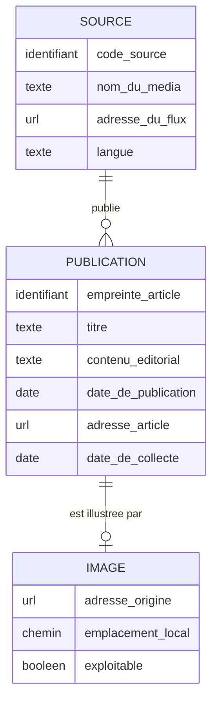

# Schéma conceptuel de données

**Projet 12 : pipeline d'acquisition de données multimodales pour la détection de fake news**
CheckIt.AI, août 2026.

## 1. Objet du document

Ce document décrit **la signification des données collectées par le pipeline**, en langage métier, indépendamment de toute technologie de stockage. Il répond à la question : de quoi parle-t-on, et qu'est-ce qui est lié à quoi.

Il ne décrit ni les tables, ni les types SQL, ni les index. Ces éléments relèvent du modèle physique et sont propres au choix de PostgreSQL retenu pour ce projet. Le modèle ci-dessous resterait valable si le stockage changeait de technologie.

## 2. Entités retenues

| Entité | Définition métier | Justification |
|---|---|---|
| **SOURCE** | Le média qui édite et diffuse de l'information. | Le pipeline industrialise une source unique, RFI, mais le cas d'usage suppose d'en agréger plusieurs. La source est donc une entité, pas un attribut figé. Le flux RSS n'est pas une entité : c'est le canal d'accès à la source, donc un de ses attributs. |
| **PUBLICATION** | Un article d'actualité diffusé par une source, porteur d'un titre et d'un contenu éditorial. | Entité centrale du métier. C'est l'objet que le détecteur de fake news classera. |
| **IMAGE** | L'illustration attachée à une publication. | C'est elle qui rend le jeu de données multimodal. Elle est traitée comme une entité à part entière car elle porte ses propres attributs de qualité et son propre cycle de collecte, distinct de celui du texte. |

## 3. Diagramme

Les types indiqués sont des **types métier** : identifiant, texte, date, url, chemin, booléen. Ils décrivent la nature de l'information, pas son encodage en base.

## 4. Relations et cardinalités

| Relation | Lecture directe | Lecture inverse |
|---|---|---|
| SOURCE publie PUBLICATION | Une source publie **zéro ou plusieurs** publications. | Une publication provient d'**une et une seule** source. |
| PUBLICATION est illustrée par IMAGE | Une publication est illustrée par **zéro ou une** image. | Une image illustre **une et une seule** publication. |

La cardinalité **zéro ou une** côté image est un choix de conception assumé : une publication dont l'illustration est absente ou inexploitable est **conservée**, avec son drapeau de qualité positionné en conséquence. Le jeu de données garde ainsi la trace des publications non multimodales plutôt que de les faire disparaître silencieusement.

## 5. Garantie du lien entre le texte et l'image

Le lien texte-image est le point critique du cas d'usage : une paire mal appariée introduit un signal faux dans l'apprentissage du détecteur.

Le modèle garantit ce lien par construction, et non par une vérification a posteriori :

1. **L'IMAGE n'a pas d'identifiant propre.** Elle est identifiée par l'empreinte de la publication qu'elle illustre. Elle est donc une **entité dépendante en identification** : son existence et son identité sont subordonnées à celles de la publication.

2. **L'empreinte de la publication est déterministe.** Elle est dérivée de l'adresse de l'article par une fonction de hachage. La même publication produit toujours la même empreinte, à chaque collecte.

3. **Cette empreinte nomme le fichier image sur le support de stockage.** Le chemin de l'illustration est donc entièrement déduit de l'identité de l'article.

Deux propriétés en découlent :

- **Une image orpheline est structurellement impossible.** Une image sans publication de rattachement n'a pas de nom, donc pas d'existence.
- **Un appariement erroné est structurellement impossible.** Le nom du fichier image n'est attribué ni par un compteur, ni par un ordre d'arrivée, mais dérivé de l'article lui-même. Aucun décalage d'indice ne peut associer l'illustration d'un article au texte d'un autre.

## 6. Rôle de chaque champ dans le cas d'usage

Le cas d'usage visé est la **classification de publications** en vue de la détection de désinformation multimodale. Les champs n'ont pas tous le même statut vis-à-vis de cet objectif.

| Champ | Entité | Modalité | Rôle |
|---|---|---|---|
| titre | PUBLICATION | Texte | **Entrée du modèle.** Signal court, fortement porteur en détection de titres sensationnalistes. |
| contenu_editorial | PUBLICATION | Texte | **Entrée du modèle.** Signal textuel principal. |
| emplacement_local | IMAGE | Image | **Entrée du modèle.** Accès à la modalité visuelle. |
| nom_du_media | SOURCE | Métadonnée | **Entrée exploitable.** La crédibilité de l'éditeur est une variable reconnue en détection de désinformation. |
| code_source | SOURCE | Métadonnée | Identification de la provenance, permet l'agrégation multi-sources. |
| langue | SOURCE | Métadonnée | Conditionne le choix des modèles de traitement du langage applicables. |
| date_de_publication | PUBLICATION | Métadonnée | Découpage temporel du jeu de données, mesure de fraîcheur, détection de recyclage d'anciens contenus. |
| exploitable | IMAGE | Métadonnée | Drapeau de qualité. Permet d'isoler les paires texte-image réellement complètes. |
| adresse_article | PUBLICATION | Traçabilité | Vérification humaine et retour à la source. Non exploité par le modèle. |
| adresse_origine | IMAGE | Traçabilité | Provenance de l'illustration. Non exploité par le modèle. |
| empreinte_article | PUBLICATION | Technique | Clé naturelle. Assure la déduplication et la rejouabilité du pipeline. Non exploité par le modèle. |
| date_de_collecte | PUBLICATION | Traçabilité | Audit d'ingestion, distinction entre date de l'événement et date de captation. Non exploité par le modèle. |

## 7. Limite connue

Le flux RSS de la source industrialisée expose le **chapô** de l'article, pas son texte intégral. Le champ `contenu_editorial` contient donc un résumé éditorial et non le corps complet de la publication.

Cette limite est documentée ici car elle conditionne l'usage aval : un détecteur entraîné sur des chapôs travaille sur un signal textuel plus court et plus dense que sur des articles complets. L'accès au texte intégral supposerait une collecte au-delà du flux RSS, hors du périmètre de ce projet.
EOF